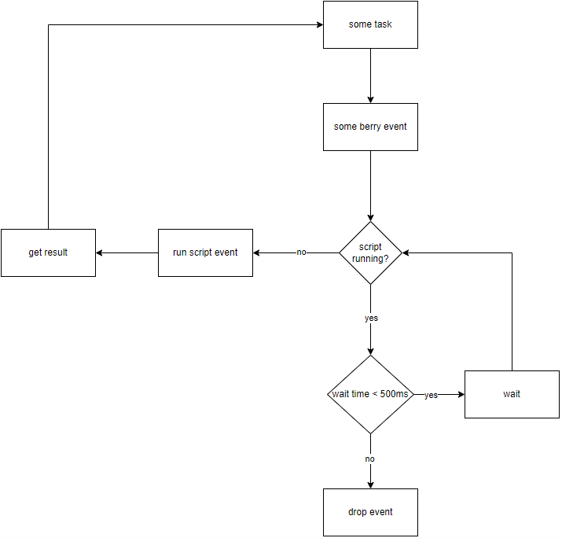

# Getting Started with Berry Scripts on SLZB-OS

## What is a Berry Script?

[Berry](https://berry-lang.github.io/) is a lightweight scripting language designed for embedded devices. SLZB-OS uses Berry to let you write custom automation scripts that run directly on your Zigbee coordinator — no separate server, no cloud, no extra hardware.

If you have never written code before, check out [Berry in 20 minutes](https://berry.readthedocs.io/en/latest/source/en/Berry-in-20-minutes.html) for a quick introduction to the language. Full Berry documentation is available [here](https://berry.readthedocs.io/en/latest/).

---

## How Scripts Work

- You can run **up to 3 scripts simultaneously** (this may increase in future firmware).
- If a script does **not** use events, it runs in its own separate task with a default stack of 5120 words.
- If a script **uses events**, it runs in the shared event task (see [Event System](#event-system) below).
- The `SLZB` module is loaded automatically. All other modules must be imported:

```berry
import ZHB     # Zigbee Hub
import HTTP    # HTTP client
import MQTT    # MQTT messaging
# etc.
```

---

## Metadata

Every script should include **metadata** — a special comment line that tells SLZB-OS how to load the script.

### Required Metadata

```
#META {"start":1}
```

Rules:
- Must start with `#META ` (the space after `#META` is required)
- Must end with a newline character
- Must be placed at the very beginning of the script file

The `start` parameter controls when the script launches:

| Value | Behavior |
|-------|----------|
| `0` | Script starts manually (you launch it from the web UI) |
| `1` | Script starts automatically when the device boots |

If a script has no metadata at all, it will not auto-start, but you can still run it manually.

### Optional Metadata

You can add optional parameters to the metadata JSON:

```
#META {"start":1, "stack":8192}
```

| Parameter | Description |
|-----------|-------------|
| `stack` | Override the default stack size (5120). Increase this if your script crashes due to out-of-memory errors. |
| `psram` | Set to `true` to place the script task entirely in PSRAM. **U-series devices only.** |

**Warning:** When `psram` is `true`, the script **cannot access the file system**. Any attempt will crash the script.

---

## Event System

> Available since v2.8.2.dev0

The event system lets you "subscribe" to things that happen in SLZB-OS — like receiving a Zigbee packet, a button press, or a webhook request — and run your code when they occur.

### How it works

1. You register a callback function for a specific event (e.g., `ZB.on_pkt(my_handler)`).
2. When the event occurs, SLZB-OS calls your function.
3. Your script's state (global variables) is preserved between calls.

### Rules for event scripts

- **Do not** use `SLZB.delay()` — events must complete quickly.
- **Do not** use infinite loops.
- **Do not** run for too long — this can block other operations (e.g., a slow `ZB.on_pkt` handler will cause Z2M/ZHA disconnections).
- If an error occurs during execution, the script is stopped and all subscriptions are canceled.
- Some events provide extra data to your callback. Check the documentation for each specific event.
- Some events use your `return` value. For example, returning `true` from `ZB.on_pkt` blocks the packet from reaching the Zigbee socket.

### Example

```berry
#META {"start":1}

def conn_cb(ip, id)
  SLZB.log("New Zigbee client connected: " .. ip)
end

ZB.on_connect(conn_cb)
```

### Multiple simultaneous events

If a script is subscribed to multiple events and they fire at the same time, they execute sequentially with a **500ms timeout**. If your handler takes longer than 500ms, you may miss the next event.



---

## What's Next?

Now that you understand the basics, explore the modules available to your scripts:

- **[SLZB — Core Functions](modules/slzb.md)** — Delays, logging, reboot, device info
- **[ZB — Zigbee Chip Access](modules/zb.md)** — Low-level Zigbee control
- **[ZHB — Zigbee Hub](modules/zhb.md)** — Control your Zigbee devices (relays, lamps, sensors)
- **[HTTP — HTTP Client](modules/http.md)** — Make web requests
- **[MQTT — Messaging](modules/mqtt.md)** — Publish and subscribe to MQTT topics
- **[TIME — Date and Time](modules/time.md)** — NTP-synced clock

See the [full module list](../README.md#module-reference) in the main README.
