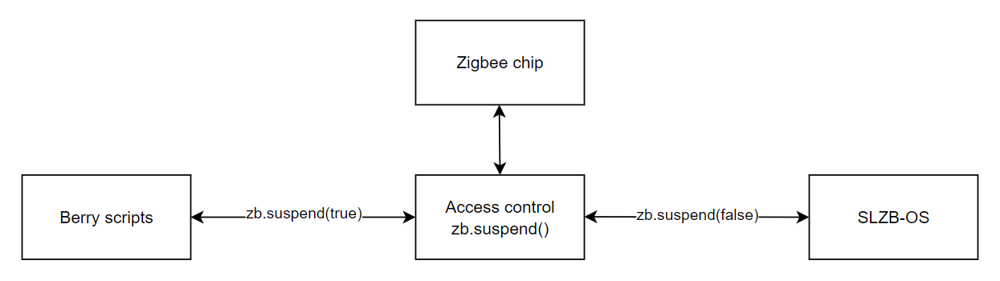

# ZB — Zigbee Chip Access

> Available since: v2.8.0 (base functions). Events since v2.8.2.dev0.

Low-level access to the Zigbee chip — read/write bytes, reboot, flash mode, and socket events.

**Use with caution** — incorrect usage can disrupt your Zigbee network.

## Quick Example

```berry
import ZB

SLZB.log("Zigbee clients: " .. ZB.getZbClients())
ZB.reboot()  # reboot the Zigbee chip
```

## Zigbee Socket Coexistence



SLZB-OS uses parallel task execution. When you want to access the Zigbee chip directly, you must first "lock" access using `ZB.suspend()`.

Most functions do this automatically, but **`ZB.readBytes()` requires manual locking** — call `ZB.suspend(true)` before reading, otherwise the parallel socket processing task may capture the Zigbee chip's response.

After executing `ZB.suspend(true)`, the following events will **not** be generated:
- `ZB.on_pkt`
- `ZB.on_connect`
- `ZB.on_disconnect`

## API Reference

| Function | Description | Returns |
|----------|-------------|---------|
| `ZB.reboot()` | Reboot the Zigbee chip immediately. | — |
| `ZB.flashMode()` | Put Zigbee chip into firmware mode. Restart the chip or send the bootloader command to return to normal mode. | — |
| `ZB.routerPairMode()` | Start network search for pairing (when chip is flashed as a router). | — |
| `ZB.writeBytes(data)` | Send bytes directly to the Zigbee chip. Arg: `bytes`. | `int` (bytes sent) |
| `ZB.readBytes()` | Read bytes from the Zigbee chip. **Requires `ZB.suspend(true)` first!** | `bytes` |
| `ZB.availableBytes()` | Number of bytes available for reading from the Zigbee chip. | `int` |
| `ZB.getZbClients()` | Number of clients connected to the Zigbee socket. | `int` |
| `ZB.suspend(state)` | Stop (`true`) or resume (`false`) Zigbee socket processing. | — |

## Events

> Available since v2.8.2.dev0

### ZB.on_pkt(callback)

Called when a new data packet is received from the Zigbee chip in network coordinator mode.

**Only generated if "Zigbee Socket packet processing" is enabled.**

Callback receives two arguments:
- `id` (`int`) — the received packet command ID
- `buf` (`bytes`) — the full packet buffer

If you return `true`, the packet will not be sent to the Zigbee socket. **(CC2652x only — does not work for EFR32x.)**

```berry
def zb_pkt_handler(id, buf)
  SLZB.log("Packet ID: " .. id)
  return false  # pass packet through
end

ZB.on_pkt(zb_pkt_handler)
```

### ZB.on_connect(callback)

Called when a new socket client connects in network coordinator mode.

Callback receives two arguments:
- `ip` (`string`) — the client's IP address
- `id` (`int`) — the client's position in the client array

Return `true` to reject the connection.

```berry
def conn_cb(ip, id)
  SLZB.log("New client: " .. ip .. " id: " .. id)
end

ZB.on_connect(conn_cb)
```

### ZB.on_disconnect(callback)

Called when a socket client disconnects in network coordinator mode.

Callback receives one argument:
- `id` (`int`) — the client's position in the client array

## See Also

- [ZHB — Zigbee Hub](zhb.md) — Higher-level device control (relays, lamps, sensors)
- [Getting Started: Event System](../getting-started.md#event-system)
- [Example: Reboot Zigbee on client drop](../../examples/basic/zb_reboot_on_drop.be)
- [Example: Report stats](../../examples/report_stats/)
