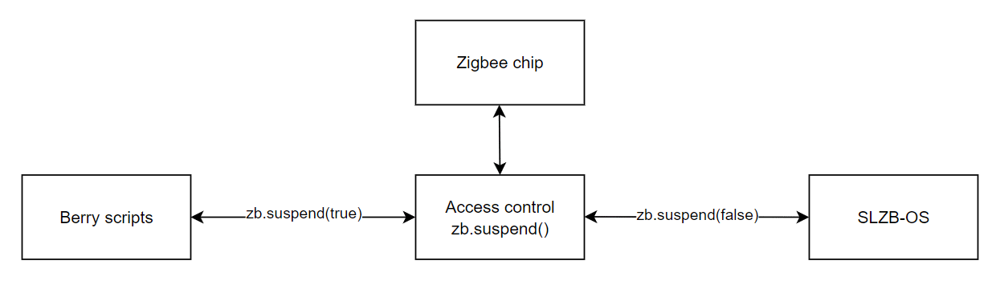

# ZB — Zigbee Chip Access

> Available since: v2.8.0 (base functions). Events since v2.8.2.dev0.

Low-level access to the Zigbee chip — read/write bytes, reboot, flash mode, and socket events.

**Use with caution** — incorrect usage can disrupt your Zigbee network.

## Quick Example

```berry
import ZB

SLZB.log("Zigbee clients: " .. ZB.getZbClients(1))
ZB.reboot(1)  # reboot the Zigbee chip 1
```

## Zigbee Socket Coexistence



SLZB-OS uses parallel task execution. When you want to access the Zigbee chip directly, you must first "lock" access using `ZB.suspend()`.

Most functions do this automatically, but **`ZB.readBytes(), readByte(), readString(), available(), writeBytes(), writeString()` requires manual locking** — call `ZB.suspend(chip_id, true)` before reading, otherwise the parallel socket processing task may capture the Zigbee chip's response.

After executing `ZB.suspend(chip_id, true)`, the following events will **not** be generated:
- `ZB.on_pkt`
- `ZB.on_connect`
- `ZB.on_disconnect`

## API Reference

| Function | Description |
|----------|-------------|
| `ZB.reboot(chip_id:int) -> nil` | Reboot the Zigbee chip immediately.<br>`chip_id` - the number of the radio module for which this command will be executed. MR series coordinators have 2 radio modules and Ultima can have 3 if the Zwave addon is installed |
| `ZB.flashMode(chip_id:int) -> nil` | Put Zigbee chip into firmware mode. Restart the chip or send the bootloader command to return to normal mode.<br>`chip_id` - radio module number. |
| `ZB.routerPairMode(chip_id:int) -> nil` | Start network search for pairing (when chip is flashed as a router). |
| `ZB.writeBytes(chip_id:int, data:bytes) -> int` | Send bytes directly to the Zigbee chip. Returns: `int` (bytes sent). |
| `ZB.readBytes(chip_id:int) -> bytes` | Read bytes from the Zigbee chip. **Requires `ZB.suspend(true)` first!** |
| `ZB.available(chip_id:int) -> int` | Number of bytes available for reading from the Zigbee chip. |
| `ZB.getZbClients(chip_id:int) -> int` | Number of clients connected to the Zigbee socket. |
| `ZB.suspend(chip_id:int, state:bool) -> nil` | Stop (`true`) or resume (`false`) Zigbee socket processing. |

## Events

> Available since v2.8.2.dev0

| Function | Description |
|----------|-------------|
| `ZB.on_pkt(callback:function(chip_id:int, id:int, buf:bytes) -> bool) -> nil` | Called when a new data packet is received from the Zigbee chip in network coordinator mode. |
| `ZB.on_connect(callback:function(chip_id:int, ip:string, id:int) -> bool) -> nil` | Called when a new socket client connects in network coordinator mode. |
| `ZB.on_disconnect(callback:function(chip_id:int, id:int) -> nil) -> nil` | Called when a socket client disconnects in network coordinator mode. |

### ZB.on_pkt(callback:function(chip_id:int, id:int, buf:bytes) -> bool) -> nil

Called when a new data packet is received from the Zigbee chip in network coordinator mode.

**Only generated if "Zigbee Socket packet processing" is enabled.**

Callback receives:
- `chip_id` (`int`) — number of the radio module for which this event occurred
- `id` (`int`) — the received packet command ID
- `buf` (`bytes`) — the full packet buffer

If you return `true`, the packet will not be sent to the Zigbee socket. **(CC2652x only — does not work for EFR32x.)**

```berry
def zb_pkt_handler(chip_id, cmd_id, buf)
  SLZB.log("Radio module: " .. chip_id .. " Packet ID: " .. cmd_id)
  return false  # pass packet through
end

ZB.on_pkt(zb_pkt_handler)
```

### ZB.on_connect(callback:function(chip_id:int, ip:string, id:int) -> bool) -> nil

Called when a new socket client connects in network coordinator mode.

Callback receives:
- `chip_id` (`int`) — number of the radio module for which this event occurred
- `ip` (`string`) — the client's IP address
- `id` (`int`) — the client's position in the client array

Return `true` to reject the connection.

```berry
def conn_cb(chip_id, ip, id)
  SLZB.log("[" .. chip_id .. "] New client: " .. ip .. " id: " .. id)
end

ZB.on_connect(conn_cb)
```

### ZB.on_disconnect(callback:function(chip_id:int, id:int) -> nil) -> nil

Called when a socket client disconnects in network coordinator mode.

Callback receives:
- `chip_id` (`int`) — number of the radio module for which this event occurred
- `id` (`int`) — the client's position in the client array

## See Also

- [ZHB — Zigbee Hub](zhb.md) — Higher-level device control (relays, lamps, sensors)
- [Getting Started: Event System](../getting-started.md#event-system)
- [Example: Reboot Zigbee on client drop](../../examples/basic/zb_reboot_on_drop.be)
- [Example: Report stats](../../examples/report_stats/)
