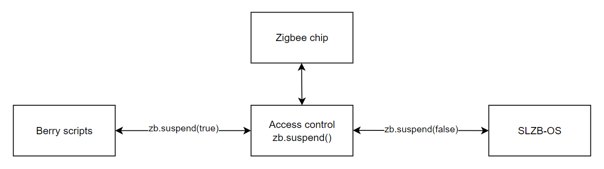

# ZB — Zigbee Chip Access

> Available since: v2.8.0 (base functions). Events since v2.8.2.dev0.

Low-level access to the Zigbee chip — read/write bytes, reboot, flash mode, and socket events.

**Use with caution** — incorrect usage can disrupt your Zigbee network.

## Quick Example

```berry
import ZB

SLZB.log("Zigbee clients: " .. ZB.getZbClients(1))
ZB.reboot(1)  # reboot the Zigbee chip 1
```

## Zigbee Socket Coexistence



SLZB-OS uses parallel task execution. When you want to access the Zigbee chip directly, you must first "lock" access using `ZB.suspend()`.

Most functions do this automatically, but **`ZB.readBytes(), readByte(), readString(), available(), writeBytes(), writeString()` requires manual locking** — call `ZB.suspend(chip_id, true)` before reading, otherwise the parallel socket processing task may capture the Zigbee chip's response.

After executing `ZB.suspend(chip_id, true)`, the following events will **not** be generated:
- `ZB.on_pkt`
- `ZB.on_connect`
- `ZB.on_disconnect`

## API Reference

| Function | Description |
|----------|-------------|
| `ZB.reboot(chip_id:int) -> nil` | Reboot the Zigbee chip immediately.<br>`chip_id` - the number of the radio module for which this command will be executed. MR series coordinators have 2 radio modules and Ultima can have 3 if the Zwave addon is installed |
| `ZB.flashMode(chip_id:int) -> nil` | Put Zigbee chip into firmware mode. Restart the chip or send the bootloader command to return to normal mode.<br>`chip_id` - radio module number. |
| `ZB.routerPairMode(chip_id:int) -> nil` | Start network search for pairing (when chip is flashed as a router). |
| `ZB.writeBytes(chip_id:int, data:bytes) -> int` | Send bytes directly to the Zigbee chip. Returns: `int` (bytes sent). |
| `ZB.readBytes(chip_id:int, max_len:int?) -> bytes` | Read the bytes received from the Zigbee chip, at most `max_len` (all available by default); never waits, returns an empty `bytes()` when nothing arrived. **Requires `ZB.suspend(true)` first!** |
| `ZB.available(chip_id:int) -> int` | Number of bytes available for reading from the Zigbee chip. |
| `ZB.getZbClients(chip_id:int) -> int` | Number of clients connected to the Zigbee socket. |
| `ZB.suspend(chip_id:int, state:bool) -> nil` | Stop (`true`) or resume (`false`) Zigbee socket processing. A radio suspended by a script is resumed automatically when that script stops (since v3.4.2). |
| `ZB.chipModel(chip_id:int=1) -> string` | Model of the radio module chip: `"CC2652P"`, `"CC2652P7"`, `"CC2674P10"`, `"EFR32MG21"`, `"EFR32MG24"`, `"EFR32MG26"`, `"EFR32ZG23"`, `"RF433"`, `"DIY"` or `"Unknown"`. Since v3.4.2. |
| `ZB.isEFR(chip_id:int=1) -> bool` | `true` if the radio module is a Silicon Labs EFR32 chip (EFR32MG21 / MG24 / MG26, and the EFR32ZG23 of Z-Wave radios). Since v3.4.2. |
| `ZB.isCC(chip_id:int=1) -> bool` | `true` if the radio module is a Texas Instruments CC chip (CC2652P / CC2652P7 / CC2674P10). Since v3.4.2. |
| `ZB.isZW(chip_id:int=1) -> bool` | `true` if the radio module is a Z-Wave radio (EFR32ZG23, e.g. the Ultima Z-Wave add-on). Since v3.4.2. |
| `ZB.getFirmwareRev(chip_id:int=1) -> int` | Revision of the firmware flashed into the radio module, e.g. `20250321` (`-1` if unknown). Since v3.4.2. |
| `ZB.getFirmwareType(chip_id:int=1) -> int` | Type of the firmware flashed into the radio module: one of the `ZB.FW_*` constants (Zigbee coordinator / router, Thread, Z-Wave, ...). Since v3.4.2. |
| `ZB._deinitUart(chip_id:int) -> nil` | **Very low-level APIs. You should really only look at these if you understand what you are doing!**<br>Stop the UART of the radio module (the driver is removed, the RX/TX pins are released). The radio itself keeps running; nothing can talk to it until `ZB._initUart()`. Since v3.4.2. |
| `ZB._initUart(chip_id:int, options:map) -> nil` | **Very low-level APIs. You should really only look at these if you understand what you are doing!**<br>(Re)start the UART of the radio module with its current parameters, replacing the ones given in `options` (`baud`, `hwFlow`, `rx`, `tx`, `rts`, `cts`, `rst`, `flsh`, `zbCip`). The new parameters are used until the next reboot, they are not saved. Since v3.4.2. |


`chipModel`, `isEFR`, `isCC`, `isZW`, `getFirmwareRev` and `getFirmwareType` raise an error if the selected radio module does not exist. The firmware revision and type are the ones SLZB-OS recorded when the radio firmware was flashed (the same values the web UI shows), the chip is not queried. A Z-Wave radio is an EFR32 chip too, so `isEFR()` is `true` for it as well — check `isZW()` first when the two must be told apart:

```berry
import ZB

for chip_id: 1 .. 3
  try
    var kind = ZB.isZW(chip_id) ? "Z-Wave" : ZB.isEFR(chip_id) ? "EFR32" : ZB.isCC(chip_id) ? "TI CC" : "other"
    SLZB.log("Radio " .. chip_id .. ": " .. ZB.chipModel(chip_id) .. " (" .. kind .. "), firmware " ..
             ZB.getFirmwareRev(chip_id) .. ", type " .. ZB.getFirmwareType(chip_id))
    if ZB.getFirmwareType(chip_id) == ZB.FW_COORDINATOR
      SLZB.log("Radio " .. chip_id .. " runs Zigbee coordinator firmware")
    end
  except .. as e, m
    break  # no more radio modules
  end
end
```

### ZB._initUart(chip_id:int, options:map) -> nil
**Very low-level APIs. You should really only look at these if you understand what you are doing!**
Low-level control of the UART between the ESP32 and the radio module, together with `ZB._deinitUart(chip_id)`. The underscore marks them as advanced: wrong pins or a wrong baud rate cut the radio off from the Zigbee socket, Zigbee Hub and the firmware updater until the parameters are fixed or the device is rebooted.

`_initUart()` takes the parameters the radio uses now and replaces those present in `options`; keys that are missing (or `nil`) keep their current value, so `ZB._initUart(1, {})` simply restarts the UART after `ZB._deinitUart(1)`. `options` must be a map, otherwise an error is raised.

| Key | Type | Description |
|-----|------|-------------|
| `baud` | int | Baud rate, e.g. `115200`, `460800` |
| `hwFlow` | bool | RTS/CTS hardware flow control (only when both `rts` and `cts` are set). Without it RTS is held low |
| `rx` | int | ESP32 GPIO of the UART RX pin |
| `tx` | int | ESP32 GPIO of the UART TX pin |
| `rts` | int | GPIO of the RTS pin |
| `cts` | int | GPIO of the CTS pin |
| `rst` | int | GPIO of the radio reset pin, driven high (radio running) by `_initUart()` |
| `flsh` | int | GPIO of the radio bootloader pin, driven high (normal boot) by `_initUart()` |
| `zbCip` | int | Chip type used by SLZB-OS for this radio (affects `chipModel()`, `isEFR()`, the bootloader sequence) — change only for a DIY / custom radio |

Pins: `255` means "not used"; on ESP32-S3 devices (U series, Ultima) `rst`, `flsh` and `rts` may also be pins of the TCA9555 I/O expander, numbered `100 + n`. `rx`, `tx` and `cts` must be ESP32 GPIOs.

Notes:
- The UART is shared with the Zigbee socket — call `ZB.suspend(chip_id, true)` before `_deinitUart()` and `ZB.suspend(chip_id, false)` after `_initUart()`.
- The new parameters stay in effect for everything that uses the radio (Zigbee socket, `ZB.readBytes()` / `writeBytes()`, `ZB.reboot()`, `ZB.flashMode()`) until the device reboots; the saved configuration is not changed.
- The radio firmware defines its own baud rate — `baud` must match it, `_initUart()` does not reconfigure the radio.
- Keys in `options` are read from firmware v3.4.2 on (the older `initUart()` ignored them and always restarted with the current parameters).
- To use "hwFlow" the radio module firmware must support hardware flow control, and the coordinator must be of the U series.

```berry
import ZB

# radio 1 was flashed with firmware that talks at 460800 baud with RTS/CTS
ZB.suspend(1, true)
ZB._deinitUart(1)
ZB._initUart(1, {"baud": 460800, "hwFlow": true})
ZB.suspend(1, false)
```

## Constants

Firmware types returned by `ZB.getFirmwareType()`:

| Constant | Value | Description |
|----------|-------|-------------|
| `ZB.FW_UNKNOWN` | -1 | Unknown firmware (never flashed by SLZB-OS, or the record is missing) |
| `ZB.FW_COORDINATOR` | 0 | Zigbee coordinator |
| `ZB.FW_ROUTER` | 1 | Zigbee router |
| `ZB.FW_THREAD_RCP` | 2 | Thread RCP (OpenThread radio co-processor) |
| `ZB.FW_MULTIPAN` | 3 | Multi-PAN (Zigbee + Thread) |
| `ZB.FW_STANDALONE` | 4 | Zigbee Hub (standalone coordinator of SLZB-OS) |
| `ZB.FW_ZWAVE_EU` | 5 | Z-Wave, EU region |
| `ZB.FW_ZWAVE_US` | 6 | Z-Wave, US region |
| `ZB.FW_ZWAVE_ANZ` | 7 | Z-Wave, ANZ region |
| `ZB.FW_THREAD_OTBR` | 8 | Thread Border Router |
| `ZB.FW_REMOTE_ROUTER` | 9 | Remote Zigbee router |

## Events

> Available since v2.8.2.dev0

| Function | Description |
|----------|-------------|
| `ZB.on_pkt(callback:function(chip_id:int, id:int, buf:bytes) -> bool) -> nil` | Called when a new data packet is received from the Zigbee chip in network coordinator mode. |
| `ZB.on_connect(callback:function(chip_id:int, ip:string, id:int) -> bool) -> nil` | Called when a new socket client connects in network coordinator mode. |
| `ZB.on_disconnect(callback:function(chip_id:int, id:int) -> nil) -> nil` | Called when a socket client disconnects in network coordinator mode. |

### ZB.on_pkt(callback:function(chip_id:int, id:int, buf:bytes) -> bool) -> nil

Called when a new data packet is received from the Zigbee chip in network coordinator mode.

**Only generated if "Zigbee Socket packet processing" is enabled.**

Callback receives:
- `chip_id` (`int`) — number of the radio module for which this event occurred
- `id` (`int`) — the received packet command ID
- `buf` (`bytes`) — the full packet buffer

If you return `true`, the packet will not be sent to the Zigbee socket. **(CC2652x only — does not work for EFR32x.)**

```berry
def zb_pkt_handler(chip_id, cmd_id, buf)
  SLZB.log("Radio module: " .. chip_id .. " Packet ID: " .. cmd_id)
  return false  # pass packet through
end

ZB.on_pkt(zb_pkt_handler)
```

### ZB.on_connect(callback:function(chip_id:int, ip:string, id:int) -> bool) -> nil

Called when a new socket client connects in network coordinator mode.

Callback receives:
- `chip_id` (`int`) — number of the radio module for which this event occurred
- `ip` (`string`) — the client's IP address
- `id` (`int`) — the client's position in the client array

Return `true` to reject the connection.

```berry
def conn_cb(chip_id, ip, id)
  SLZB.log("[" .. chip_id .. "] New client: " .. ip .. " id: " .. id)
end

ZB.on_connect(conn_cb)
```

### ZB.on_disconnect(callback:function(chip_id:int, id:int) -> nil) -> nil

Called when a socket client disconnects in network coordinator mode.

Callback receives:
- `chip_id` (`int`) — number of the radio module for which this event occurred
- `id` (`int`) — the client's position in the client array

## See Also

- [ZHB — Zigbee Hub](zhb.md) — Higher-level device control (relays, lamps, sensors)
- [Getting Started: Event System](../getting-started.md#event-system)
- [Example: Reboot Zigbee on client drop](../../examples/basic/zb_reboot_on_drop.be)
- [Example: Report stats](../../examples/report_stats/)
